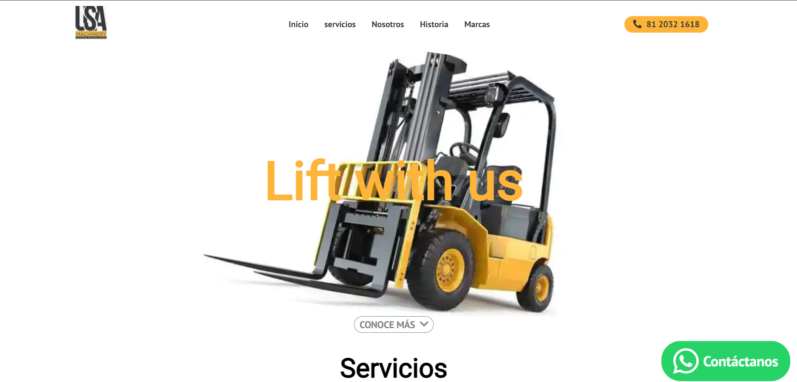

    

<h1 id="web">USA MACHINERY web page</h1>

Empresa con mas de 10 años de experiencia en renta y venta de montacargas, venta de refacciones y servicio técnico a clientes con equipos

You can see the live preview → [USA MACHINERY web]("").

## Table of contents

- [Usa Machinery web page](#web)
- [Getting started](#scripts)
- [Preview](#preview)
  - [Desktop](#desktop)
  - [Mobile](#mobile)
- [Technologies](#technologies)

<h2 id="scripts">🔥 Getting started</h2>
Once you have downloaded the project to local enviroment you need to execute npm install and then gatsby develop to see the project in action
 
 

<h2 id="preview">🔍 Preview</h2>

  
💻 Desktop version
    
  

  
📱 Mobile version
  
  

 
 
<h2 id="technologies">📲 Technologies</h2>

1. Semantic HTML
2. Vanilla CSS
3. React.js
4. Gatsby
5. Emotion
6. React Helmet
